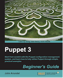

```
Roberto Nogueira  
BSd EE, MSd CE
Solution Integrator Experienced - Certified by Ericsson
```
# eBook Puppet 3



**About**

Learn everything you need to about the subject of this `eBook` project.

[Homepage](https://www.packtpub.com/networking-and-servers/puppet-3-beginner%E2%80%99s-guide)

## Topics
```
Table of Contents

[ ] 1: INTRODUCTION TO PUPPET
[ ] 2: FIRST STEPS WITH PUPPET
[ ] 3: PACKAGES, FILES, AND SERVICES
[ ] 4: MANAGING PUPPET WITH GIT
[ ] 5: MANAGING USERS
[ ] 6: TASKS AND TEMPLATES
[ ] 7: DEFINITIONS AND CLASSES
[ ] 8: EXPRESSIONS AND LOGIC
[ ] 9: REPORTING AND TROUBLESHOOTING
[ ] 10: MOVING ON UP
```
